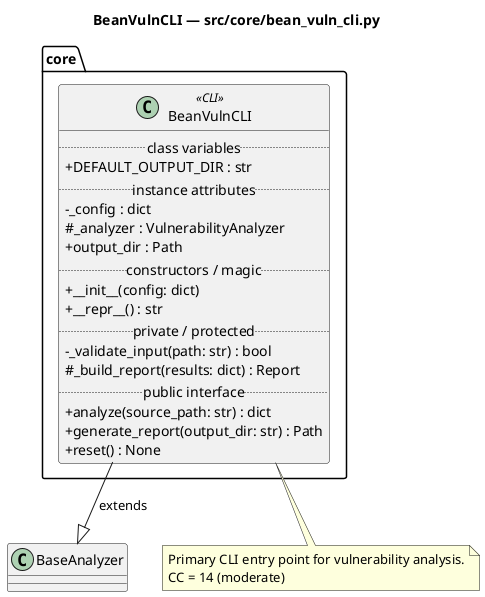
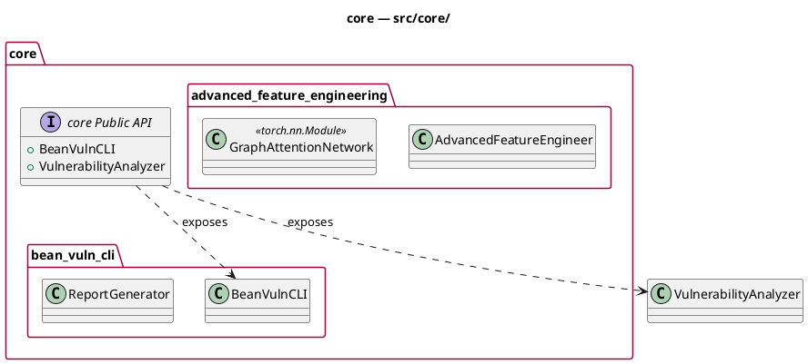
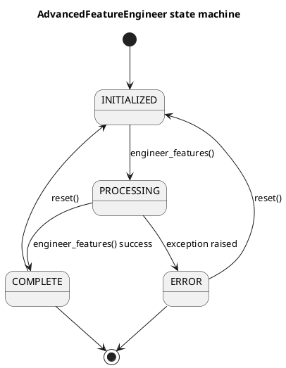
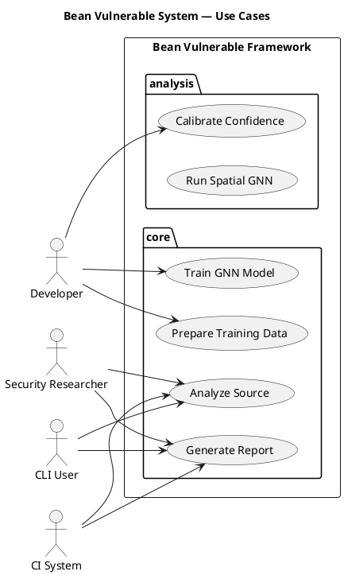

# UML Documentation Guide — Bean Vulnerable

> **Standards:** UML 2.5 (ISO/IEC 19505-1:2012), IEEE 1016-2009 (Software Design Descriptions),
> McCabe Cyclomatic Complexity (IEEE Std 1008), and IEEE Std 42010 (Architecture Description).
>
> This guide applies to all contributors — security researchers and software engineers alike.
> Following these standards ensures that every diagram communicates unambiguously and that
> the documentation remains maintainable as the codebase grows.

---

## Table of Contents

1. [Overview and Purpose](#1-overview-and-purpose)
2. [Folder Structure](#2-folder-structure)
3. [Diagram Types and When to Use Them](#3-diagram-types-and-when-to-use-them)
   - 3.1 [Class Diagrams](#31-class-diagrams)
   - 3.2 [Package Diagrams](#32-package-diagrams)
   - 3.3 [Component Diagrams](#33-component-diagrams)
   - 3.4 [Activity Diagrams](#34-activity-diagrams)
   - 3.5 [Sequence Diagrams](#35-sequence-diagrams)
   - 3.6 [State Diagrams](#36-state-diagrams)
   - 3.7 [Use Case Diagrams](#37-use-case-diagrams)
4. [Cyclomatic Complexity and Sub-Diagram Rules](#4-cyclomatic-complexity-and-sub-diagram-rules)
5. [UML Visibility Conventions](#5-uml-visibility-conventions)
6. [Naming Conventions](#6-naming-conventions)
7. [PlantUML Syntax Reference](#7-plantuml-syntax-reference)
8. [Auto-Generation Workflow](#8-auto-generation-workflow)
9. [Manual Contribution Guidelines](#9-manual-contribution-guidelines)
10. [Rendering and CI](#10-rendering-and-ci)
11. [Authoritative References](#11-authoritative-references)

---

## 1. Overview and Purpose

UML (Unified Modeling Language) is an ISO/IEC-standardized visual language for describing
software systems. In this repository, UML diagrams serve two purposes:

**For security researchers** — diagrams expose taint flow paths, state machine boundaries,
component trust boundaries, and the interaction chains that lead to vulnerabilities.
Understanding the system architecture at a glance accelerates vulnerability hunting.

**For software engineers** — diagrams define the intended design, document actual behavior,
and provide an on-ramp for contributors unfamiliar with the codebase. They also serve as
a regression check: if the code diverges from the diagram, one of them is wrong.

All diagrams are **auto-generated** from `/src/` Python source using `generate_puml.py`
and rendered to SVG by the GitHub Actions CI workflow. Manual diagrams are welcome for
architectural decisions, threat models, and design documents not derivable from code.

---

## 2. Folder Structure

```
docs/UML/
├── Source/                        # PlantUML .puml source files (committed, auto-generated)
│   ├── <module>/                  # One directory per Python module
│   │   ├── Class/                 # Class diagrams — one per class
│   │   ├── Activity/              # Activity diagrams — one per .py file (+ sub-groups if CC > 10)
│   │   ├── Sequence/              # Sequence diagrams — one per .py file (+ sub-groups if CC > 10)
│   │   ├── State/                 # State diagrams — one per stateful class
│   │   ├── Package/               # Package diagram for this module's directory
│   │   └── UseCase/               # Use case contributions from this module
│   ├── Package/
│   │   └── system-package-overview.puml   # System-level package diagram
│   ├── Component/
│   │   └── system-component-overview.puml # System-level component diagram
│   ├── State/
│   │   └── system-state-overview.puml     # Composite system state machine
│   └── UseCase/
│       └── system-usecase.puml            # Single system-level use case diagram
│
├── Activity/                      # Rendered SVGs — Activity diagrams
├── Class/                         # Rendered SVGs — Class diagrams
├── Component/                     # Rendered SVGs — Component diagrams
├── Package/                       # Rendered SVGs — Package diagrams
├── Sequence/                      # Rendered SVGs — Sequence diagrams
├── State/                         # Rendered SVGs — State diagrams
└── UseCase/                       # Rendered SVGs — Use case diagrams
```

**Rule:** Never commit `.svg` files to `Source/`. Never commit `.puml` files outside `Source/`.
The CI workflow manages all rendering automatically.

---

## 3. Diagram Types and When to Use Them

### 3.1 Class Diagrams

**Standard:** UML 2.5 §9 — Classifiers  
**Purpose:** Document the structure of a class — its attributes, methods, visibility,
stereotypes, and relationships to other classes.

**Granularity rule:** One diagram per class. No exceptions.

**What to include:**
- All attributes and methods regardless of visibility (public `+`, protected `#`, private `-`)
- Type annotations for attributes and method parameters
- Return types for all methods
- Stereotypes (`<<abstract>>`, `<<dataclass>>`, `<<interface>>`, etc.)
- Inheritance (`--|>`) and association (`-->`) relationships
- Class-level CC annotation when CC > 10

**What NOT to include in a class diagram:**
- Method body logic (that belongs in Activity diagrams)
- Temporal interaction sequences (that belongs in Sequence diagrams)
- Runtime state transitions (that belongs in State diagrams)

**Example:**


---

### 3.2 Package Diagrams

**Standard:** UML 2.5 §12 — Packages  
**Purpose:** Show the namespace boundaries of a Python package (directory), the classes
it contains, and the public interface it exposes via `__init__.py`.

**Granularity rule:**
- One diagram per Python package directory
- One system-level parent diagram showing all packages and their relationships

**What to include:**
- All modules (sub-packages) within the directory
- All classes within each module
- The public API boundary defined by `__init__.py` (`__all__`)
- Inheritance relationships visible at the package level

**What NOT to include:**
- Method bodies or attribute details (use Class diagrams)
- Runtime message flows (use Sequence diagrams)

**Example:**


---

### 3.3 Component Diagrams

**Standard:** UML 2.5 §11 — Components  
**Purpose:** Show the structural decomposition of the system into components
(independently deployable units), their provided and required interfaces,
and dependencies between components and external systems.

**Granularity rule:**
- One component diagram per top-level package showing intra-package interfaces
- One system-level component diagram showing all inter-package interfaces

**What to include:**
- Components (modules/packages as deployment units)
- Provided interfaces (public classes/APIs the component exposes)
- Required interfaces (APIs the component depends on)
- External system dependencies (Joern, PyTorch, NumPy, etc.)
- Dependency direction via `..>` (requires) and `--` (provides)

**Key distinction from Package diagrams:**
Package diagrams show *namespace ownership*. Component diagrams show *interface contracts*
and *dependency direction* — who depends on whom and through what interface.

---

### 3.4 Activity Diagrams

**Standard:** UML 2.5 §15 — Activities  
**Purpose:** Model the procedural flow of behavior within a Python source file —
the sequence of actions, decision points, loops, concurrency, and exception handling.

**Granularity rule (critical):**

| Module CC | Rule |
|-----------|------|
| CC 1–10   | One activity diagram for the entire `.py` file |
| CC > 10   | One parent activity diagram + sub-activity diagrams per logical call group; parent references sub-diagrams via `ref` frames |

**Sub-grouping logic:** Sub-groups are formed by call-graph connected components —
methods that call each other belong in the same sub-group. This follows the
single-responsibility principle and produces cohesive, readable diagrams.

**What to include:**
- All control flow: `if/elif/else`, `for`, `while`, `try/except/finally`, `with`
- All significant state changes (`self.state = X`)
- All `return` and `raise` statements as terminal nodes
- Method calls to other objects as action nodes
- Input parameters as initial notes

**What NOT to include per method individually:**
Individual methods do NOT get their own Activity diagram unless they have CC > 10.
The file-level diagram partitions by method using `partition` blocks.

**Example — parent referencing a sub-diagram:**
```plantuml
@startuml advanced_feature_engineering-activity
title advanced_feature_engineering — activity overview (CC=34)
note: Cyclomatic Complexity = 34 (High)

start

  partition "engineer_features()" {
    note right: params: code_data
    ref : see advanced_feature_engineering-activity-engineer_features
  }

  partition "get_feature_statistics()" {
    :stats = {}; 
    :return stats;
    stop
  }

stop

note bottom
  Referenced sub-activity diagrams:
  * advanced_feature_engineering-activity-engineer_features
  * advanced_feature_engineering-activity-_extract_gat_features
end note
@enduml
```

---

### 3.5 Sequence Diagrams

**Standard:** UML 2.5 §17 — Interactions  
**Purpose:** Model the chronological sequence of messages exchanged between objects
(participants) within a Python source file. Focus on *who calls whom* and *in what order*.

**Granularity rule:** Same as Activity diagrams:
- One sequence diagram per `.py` file
- Sub-sequence diagrams when module CC > 10
- Individual methods do NOT get their own sequence unless they are themselves CC > 10

**What to include:**
- All inter-object method calls (e.g., `self.analyzer.scan(path)`)
- Activation bars showing object lifetimes
- `alt`/`opt`/`loop` combined fragments for conditional and iterative flows
- `ref` frames pointing to sub-sequence diagrams for complex flows
- Return values on reply arrows

**What NOT to include:**
- Internal variable assignments with no inter-object communication
- Pure utility computations with no object interaction

**Example — file with inter-class calls:**
```plantuml
@startuml bean_vuln_cli-sequence
title bean_vuln_cli — sequence

participant "BeanVulnCLI" as BeanVulnCLI
participant "VulnerabilityAnalyzer" as VulnerabilityAnalyzer
participant "ReportGenerator" as ReportGenerator

== analyze() ==
[-> BeanVulnCLI: analyze(source_path)
activate BeanVulnCLI
  note over BeanVulnCLI: params: source_path

  alt source_path is valid
    BeanVulnCLI -> VulnerabilityAnalyzer: scan(source_path)
    activate VulnerabilityAnalyzer
    VulnerabilityAnalyzer --> BeanVulnCLI: results
    deactivate VulnerabilityAnalyzer
  else source_path invalid
    BeanVulnCLI -> BeanVulnCLI: _validate_input()
  end

  BeanVulnCLI -> ReportGenerator: generate_html(results)
  activate ReportGenerator
  ReportGenerator --> BeanVulnCLI: Path
  deactivate ReportGenerator

BeanVulnCLI --> [: dict
deactivate BeanVulnCLI
@enduml
```

---

### 3.6 State Diagrams

**Standard:** UML 2.5 §14 — State Machines  
**Purpose:** Model the discrete states an object can occupy and the transitions
between those states triggered by events or method calls.

**Granularity rule:**
- One state diagram per class that tracks state via `self.state`, `self.status`,
  `self.phase`, `self.mode`, or `self.stage` attributes
- One system-level composite state diagram when multiple classes share
  interconnected states — this parent diagram references class-level sub-state
  diagrams and shows the inter-class state dependencies

**What to include:**
- All discrete states (detected from `self.state = X` assignments)
- All transitions (method calls that trigger state changes)
- Initial pseudo-state `[*] -->` and terminal pseudo-states `--> [*]`
- Guard conditions where relevant
- Entry/exit actions where derivable

**State detection heuristic:** The generator detects state-carrying classes
automatically. When adding state manually, any class with `self.state = "VALUE"`
assignments across multiple methods qualifies.

**Example:**


---

### 3.7 Use Case Diagrams

**Standard:** UML 2.5 §18 — Use Cases  
**Purpose:** Show the system boundary, the actors who interact with the system,
and the use cases (observable behaviors of value) the system provides.
Use cases are *not* methods — they are user-visible capabilities.

**Granularity rule:**
- One system-level use case diagram encompassing all actors and all use cases
- Sub-use-case diagrams only when a specific use case has CC > 10 and contains
  significant `<<extend>>` or `<<include>>` relationships worth documenting separately

**Actors in this system:**
| Actor | Role |
|-------|------|
| `Developer` | Builds, trains, and configures the framework |
| `SecurityResearcher` | Runs analysis, audits code, interprets results |
| `CLI_User` | Invokes `bean-vuln` / `bean-vuln2` from the command line |
| `CI_System` | Automated pipeline invoking the framework on pull requests |

**Example:**


---

## 4. Cyclomatic Complexity and Sub-Diagram Rules

Cyclomatic complexity (CC) was defined by Thomas McCabe (1976) and is the
authoritative metric for code complexity in software engineering. It measures
the number of linearly independent paths through a unit of code.

**Formula:** `CC = 1 + number of decision points`

**Decision points counted:**
`if`, `elif`, `for`, `while`, `try/except` (per handler), `with`, `assert`,
`match/case`, boolean operators (`and`/`or` — each additional operand adds 1).

**CC thresholds (strict — per project standard):**

| CC Range | Classification | Action |
|----------|---------------|--------|
| 1–10     | Simple, well-structured | Single diagram for the file |
| > 10     | Complex | Parent diagram + sub-diagrams; parent uses `ref` frames |
| > 50     | Unmaintainable | Flag for refactoring in addition to documentation |

> **Why CC > 10?** The McCabe standard defines CC > 10 as the threshold above which
> a unit of code carries enough complexity to warrant decomposition — in testing, in
> refactoring, and in documentation. Using this same threshold for sub-diagrams keeps
> UML documentation tightly aligned with code quality standards and produces more
> granular, readable diagrams for a codebase with security-critical paths.

**Sub-grouping:** When CC > 10, sub-groups are formed by call-graph connected
components. Methods that call each other form a cohesive group. This is aligned
with the cohesion principle from Yourdon and Constantine (1979) and ensures that
sub-diagrams represent meaningful behavioral units rather than arbitrary splits.

**The `ref` frame:** When a parent diagram references a sub-diagram, use PlantUML's
`ref` keyword:
```plantuml
ref : see module-activity-subgroup_name
```

---

## 5. UML Visibility Conventions

Python does not enforce access control, but UML visibility markers communicate
*intended* access. This repository follows the PEP 8 naming convention mapped
to UML visibility:

| Python naming | UML symbol | Meaning |
|--------------|-----------|---------|
| `public_name` | `+` | Public — part of the class's public interface |
| `_protected_name` | `#` | Protected — intended for subclasses only |
| `__private_name` | `-` | Private — internal implementation detail |
| `__dunder__` | `+` | Public magic method (always public) |

**Rule:** All members must appear in the class diagram regardless of visibility.
Omitting private members is a common mistake that produces incomplete documentation
and hides implementation complexity relevant to security analysis.

---

## 6. Naming Conventions

All `.puml` files follow this naming scheme:

| Diagram type | File name pattern | Example |
|-------------|------------------|---------|
| Class | `<module>-<ClassName>.puml` | `bean_vuln_cli-BeanVulnCLI.puml` |
| Activity (file) | `<module>-activity.puml` | `bean_vuln_cli-activity.puml` |
| Activity (sub) | `<module>-activity-<group>.puml` | `bean_vuln_cli-activity-scan_group.puml` |
| Sequence (file) | `<module>-sequence.puml` | `bean_vuln_cli-sequence.puml` |
| Sequence (sub) | `<module>-sequence-<group>.puml` | `bean_vuln_cli-sequence-report_group.puml` |
| State (class) | `<module>-<ClassName>-state.puml` | `bean_vuln_cli-BeanVulnCLI-state.puml` |
| State (system) | `system-state-overview.puml` | |
| Package (dir) | `<package>-package.puml` | `core-package.puml` |
| Package (system) | `system-package-overview.puml` | |
| Component (pkg) | `<package>-component.puml` | `core-component.puml` |
| Component (sys) | `system-component-overview.puml` | |
| UseCase (system) | `system-usecase.puml` | |
| UseCase (sub) | `<module>-usecase-<name>.puml` | `bean_vuln_cli-usecase-analyze.puml` |

**`@startuml` identifier** must match the file stem (without `.puml`) to ensure
the rendered SVG filename is predictable and matches the source file.

---

## 7. PlantUML Syntax Reference

### Visibility markers
```plantuml
class Example {
  + publicAttribute : str
  # protectedAttribute : int
  - privateAttribute : dict
  + {static} CLASS_CONSTANT : str
  + publicMethod(param: str) : bool
  # _protectedMethod() : None
  - __privateMethod(x: int, y: int) : float
  + {abstract} abstractMethod() : None
}
```

### Inheritance and relationships
```plantuml
Child --|> Parent : extends
ClassA --> ClassB : uses
ClassA ..> ClassB : depends on
ClassA --* ClassB : composition
ClassA --o ClassB : aggregation
InterfaceA <|.. ImplementingClass : implements
```

### Activity partitions and references
```plantuml
start
partition "methodName()" {
  :action one;
  if (condition?) then (yes)
    :handle yes;
  else (no)
    :handle no;
  endif
  ref : see module-activity-subgroup
}
stop
```

### Sequence combined fragments
```plantuml
alt condition is true
  A -> B: message
else condition is false
  A -> C: alternate message
end

loop for each item
  A -> B: process(item)
end

opt optional operation
  A -> B: optional()
end

ref over A, B : see sub-sequence-diagram
```

### State machine
```plantuml
[*] --> IDLE
IDLE --> RUNNING : start()
RUNNING --> COMPLETE : finish()
RUNNING --> ERROR : exception()
ERROR --> IDLE : reset()
COMPLETE --> [*]
ERROR --> [*]
```

### Package and component
```plantuml
' Package
package mypackage {
  class MyClass
}

' Component with provided/required interfaces
component [MyComponent] as MC
interface "IMyService" as IMS
MC -- IMS : provides
MC ..> [ExternalDep] : requires
```

---

## 8. Auto-Generation Workflow

The `generate_puml.py` script in the repository root auto-generates all `.puml` files
from `/src/` using Python's `ast` module (no imports, no execution required).

**Prerequisites:** Python 3.10+ (uses `ast.unparse` and `match` statement support).

**Run from repo root:**
```bash
# Full generation (all diagram types)
python generate_puml.py

# Preview without writing files
python generate_puml.py --dry-run

# Skip expensive diagram types during development
python generate_puml.py --skip-sequence --skip-activity

# Verbose — see every file as it's written
python generate_puml.py --verbose

# Custom paths
python generate_puml.py --src src --out docs/UML/Source
```

**After running:**
```bash
git add docs/UML/Source/
git commit -m "feat(uml): regenerate PlantUML sources from src/"
git push
```

The GitHub Actions workflow (`.github/workflows/render-uml.yml`) automatically renders
all `.puml` files to `.svg` on every push that touches `docs/UML/Source/**/*.puml`.

**CC thresholds used by the generator:**
- CC > 10: Generate sub-diagrams; parent references them via `ref` frames
- 

---

## 9. Manual Contribution Guidelines

### When to add a manual diagram

The auto-generator covers structural and behavioral diagrams derivable from code.
Add manual diagrams for:

- **Threat models** — data flow diagrams (DFD) showing trust boundaries and attack surfaces
- **Architecture decision records (ADRs)** — diagrams explaining *why* a design was chosen
- **Deployment diagrams** — showing how components map to infrastructure
- **Future state diagrams** — showing planned, not-yet-implemented architecture

### Manual diagram placement

Place manual `.puml` files in the appropriate `docs/UML/Source/<module>/` subfolder
following the same naming convention. They will be picked up and rendered by CI automatically.

### Checklist before committing a diagram

- [ ] `@startuml <name>` identifier matches the file stem exactly (no spaces)
- [ ] Only one `@startuml`/`@enduml` block per file
- [ ] All class members shown with correct visibility markers (`+`, `#`, `-`)
- [ ] Diagram has a `title` line
- [ ] Relationships use correct UML notation (not freeform arrows)
- [ ] If CC > 10, sub-diagrams exist and are referenced from the parent via `ref`
- [ ] File placed in the correct diagram type subfolder

### Updating diagrams after code changes

Whenever `/src/` changes:
```bash
python generate_puml.py
git add docs/UML/Source/
git commit -m "feat(uml): update diagrams for <changed module>"
git push
```

The CI workflow handles rendering. You do not need PlantUML installed locally,
though it is useful for local preview:
```bash
# Local preview (requires plantuml.jar)
java -jar plantuml.jar -tsvg docs/UML/Source/core/bean_vuln_cli/Class/bean_vuln_cli-BeanVulnCLI.puml
```

---

## 10. Rendering and CI

The `.github/workflows/render-uml.yml` workflow:

1. Triggers on pushes to `main`/`develop` that touch `docs/UML/Source/**/*.puml`
2. Installs Java 17 (Temurin) and Graphviz
3. Downloads PlantUML JAR (pinned to v1.2026.3)
4. Runs `map_and_render.sh` which:
   - Detects diagram type from source path (takes priority) or file content
   - Computes output path: `docs/UML/<Type>/<subdir>/`
   - Renders to SVG via `java -jar plantuml.jar -tsvg`
   - Moves SVGs to correct output location (bypasses PlantUML `-o` path quirks)
5. Force-adds all generated SVGs (`git add -f`) and commits with `[skip ci]`

**Diagram type detection order:**
1. Path-based (e.g., file in `Source/core/foo/Class/` → `Class/`)
2. Content-based (grep for PlantUML keywords: `class`, `->`, `[*]`, etc.)
3. Fallback: `Other/`

**Output path format:**
```
docs/UML/Source/core/foo/Class/foo-Bar.puml
              → docs/UML/Class/core/foo/foo-Bar.svg
```

---

## 11. Authoritative References

| Standard | Title | Relevance |
|----------|-------|-----------|
| ISO/IEC 19505-1:2012 | UML 2.5 Infrastructure | All diagram type semantics |
| ISO/IEC 19505-2:2012 | UML 2.5 Superstructure | Interaction, state machine, activity |
| IEEE Std 1016-2009 | Software Design Descriptions | Documentation structure |
| IEEE Std 42010-2011 | Architecture Description | System/component diagrams |
| IEEE Std 1008-1987 | Software Unit Testing | Cyclomatic complexity application |
| McCabe (1976) | "A Complexity Measure" | CC formula and thresholds |
| Yourdon & Constantine (1979) | Structured Design | Cohesion-based grouping |
| RUP (Rational Unified Process) | Use Case Modeling | Use case actor/boundary rules |

**Online resources:**
- [PlantUML documentation](https://plantuml.com)
- [UML 2.5 specification (OMG)](https://www.omg.org/spec/UML/2.5.1/)
- [McCabe complexity explained (NIST)](https://www.nist.gov/publications/complexity-measures)

---

*This document is maintained alongside the codebase. When the architecture changes,
update the diagrams and this guide together. Stale documentation is worse than no documentation.*